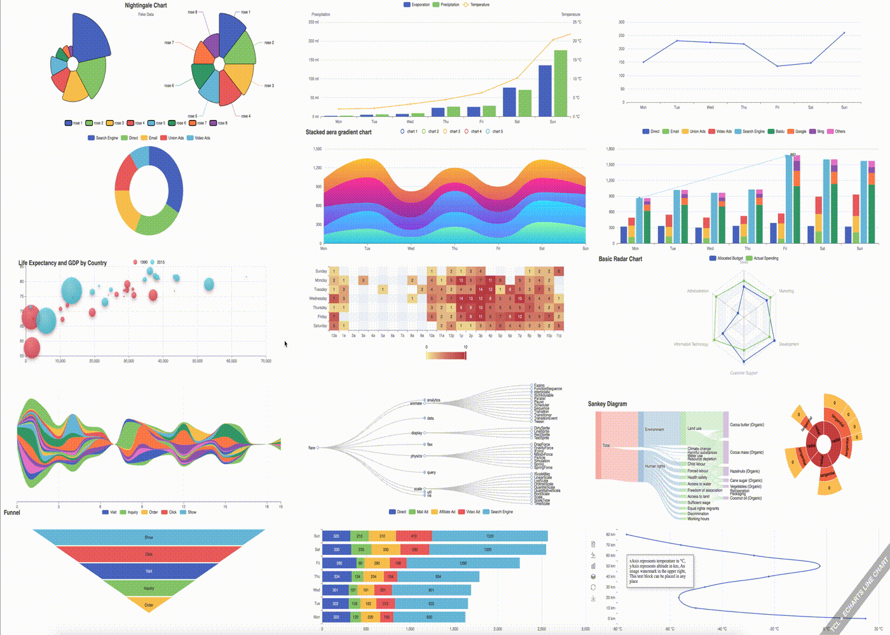

ticklEcharts - chart library
==========================
Tcl wrapper for [Apache ECharts](https://echarts.apache.org/en/index.html) (JavaScript Visualization library).

Dependencies :
-------------------------

`huddle` package from [Tcllib](https://www.tcl.tk/software/tcllib/)

Usage :
-------------------------

```tcl
package require ticklecharts

set chart [ticklecharts::chart new]

$chart Xaxis -data [list {Mon Tue Wed Thu Fri Sat Sun}]
$chart Yaxis
$chart AddLineSeries -data [list {150 230 224 218 135 147 260}]

$chart Render
```

```tcl
# Initializes a new 2D Chart Class
set chart [ticklecharts::chart new]
```
##### :heavy_check_mark: Arguments available :
| args | Type | Description
| ------ | ------ | ------
| _-backgroundColor_ | string \| jsfunc | canvas color background (hex, rgb, rgba color)
| _-color_ | list of list | list series chart colors should be a list of list like this : `[list {red blue green}]`
| _-animation_ | boolean | chart animation (default `True`)
| _-others_ | _ | animation sub options (see proc: `ticklecharts::globaloptions` in `global_options.tcl`)
| _-theme_ | string value | set the default theme for chart instance (default `basic`) possible values: `vintage,westeros,wonderland,dark`
```tcl
# Demo
set chart [ticklecharts::chart new -color [list {red blue green}] -animation "False" -theme "vintage"]
```
```tcl
# Initializes X axis with values
$chart Xaxis -data [list {Mon Tue Wed Thu Fri Sat Sun}]
```
:warning: Important `-data` option should be a `[list {...}]` and not `{{...}}`
```tcl
# Initializes Y axis
$chart Yaxis
```
```tcl
# Initializes line series
$chart AddLineSeries -data [list {150 230 224 218 135 147 260}]
```
Here `-data` corresponds to the Y values. (:warning: `-data` option should be a `[list {...}]` and not `{{...}}`)

```tcl
# Export chart to html
$chart Render
```
##### :heavy_check_mark: Arguments available :
| args | Description
| ------ | ------
| _-title_ | header title html
| _-width_ | size html canvas  (default value : `900px`)
| _-height_ | size html canvas (default value : `500px`)
| _-render_ | 'canvas' or 'svg' (default value : `canvas`)
| _-jschartvar_ | name chart var (default value : `chart_[clock clicks]`) 
| _-divid_ | name id var (default value : `id_[clock clicks]`) 
| _-outfile_ | full path html (output by default in `[info script]/render.html`)
| _-jsecharts_ | full path `echarts.min.js` (by default `cdn` script)
| _-jsvar_ | name js var (default value : `option`)

```tcl
# Demo
$chart Render -width "1200px" -height "800px" -render "svg"
```
Data :
-------------------------
`-data` in _series_ can be written like this : 
```tcl
# Demo
$chart AddLineSeries -data [list {Mon 150} {Tue 230} {Wed 224} {... ...}]
# Mon = X value
# 150 = Y value
# And now -data in Xaxis method can be deleted and written like this :
$chart Xaxis
```
With `-datalineitem` (for _lineseries_) flag :
```tcl
# Additional options on the graph... see ticklecharts::LineItem in options.tcl
$chart AddLineSeries -datalineitem {
                                {name "Mon" value 150}
                                {name "Tue" value 230}
                                {name "Wed" value 224}
                                {name "Thu" value 218}
                                {name "Fri" value 135}
                                {name "Sat" value 147}
                                {name "Sun" value 260}
                                }
```
Useful methods :
-------------------------

1. Get default _options_ according to a `key` (name of procedure) :
```tcl
# get all options for title...
$chart getoptions -title
# output :
id                -validvalue {}                      -type str|null   -default "nothing"
show              -validvalue {}                      -type bool       -default "True"
text              -validvalue {}                      -type str|null   -default "nothing"
link              -validvalue {}                      -type str|null   -default "nothing"
target            -validvalue formatTarget            -type str        -default "blank"
textStyle         -validvalue {}                      -type dict|null
  color                -validvalue formatColor          -type str|null       -default $color
  fontStyle            -validvalue formatFontStyle      -type str            -default "normal"
  fontWeight           -validvalue formatFontWeight     -type str|num        -default $fontWeight
  fontFamily           -validvalue {}                   -type str            -default "sans-serif"
  fontSize             -validvalue {}                   -type num            -default $fontSize
  lineHeight           -validvalue {}                   -type num|null       -default "nothing"
  width                -validvalue {}                   -type num            -default 100
  height               -validvalue {}                   -type num            -default 50
  textBorderColor      -validvalue {}                   -type str|null       -default "null"
  textBorderWidth      -validvalue {}                   -type num            -default 0
  textBorderType       -validvalue formatTextBorderType -type str|num|list.n -default "solid"
  textBorderDashOffset -validvalue {}                   -type num            -default 0
  textShadowColor      -validvalue formatColor          -type str            -default "transparent"
  textShadowBlur       -validvalue {}                   -type num            -default 0
  textShadowOffsetX    -validvalue {}                   -type num            -default 0
  textShadowOffsetY    -validvalue {}                   -type num            -default 0
  overflow             -validvalue formatOverflow       -type str|null       -default "null"
  ellipsis             -validvalue {}                   -type str            -default "..."
subtext           -validvalue {}                      -type str|null   -default "nothing"
sublink           -validvalue {}                      -type str|null   -default "nothing"
 ...
 ...
# following options voluntarily deleted... 
```
2. Delete _series_ by index:
```tcl
$chart AddLineSeries -data [list {1 2 3 4}]
$chart AddBarSeries  -data [list {4 5 6 7}]

# Delete bar series :
$chart deleteseries 1
```

Javascript function :
-------------------------
Add a `javascript` function to `json` :
```tcl
# Initializes a new jsfunc Class
ticklecharts::jsfunc new {function}
```
This function will be able to be inserted directly into the `JSON` data and will also create a new type `jsfunc`.
```tcl
# Demo
set js [ticklecharts::jsfunc new {function (value, index) {
                                return value + ' (C°)';
                                },
                                }]

$chart Xaxis -axisLabel [list show "True" \
                              margin 8 \
                              formatter $js \
                              showMinLabel "null" \
                              ... ]

# json result :
"axisLabel": {
  "show": true,
  "margin": 8,
  "formatter": function (value, index) {
                          return value + ' (C°)';
                          },
  "showMinLabel": null,
  ...
}
```
Examples :
-------------------------
See **[examples](/examples)** for all demos (from [apache Echarts examples](https://echarts.apache.org/examples/en/index.html))

```tcl
# line + bar on same canvas...
package require ticklecharts

# init chart class...
set chart [ticklecharts::chart new]

# Set options :
$chart SetOptions -tooltip {show True trigger "axis" axisPointer {type "cross" crossStyle {color "#999"}}} \
                  -grid {left "3%" right "4%" bottom "3%" containLabel "True"} \
                  -legend {}
               
$chart Xaxis -data [list {"Mon" "Tue" "Wed" "Thu" "Fri" "Sat" "Sun"}] \
             -axisPointer {type "shadow"}

# 2 choices to set 'formatter' flag 
# special char '<0123>' to replace this '{' and '<0125>' to replace this '}'
# or 
# ticklecharts::jsfunc...
$chart Yaxis -name "Precipitation" -position "left" -min 0 -max 250 -interval 50 \
                                   -axisLabel {formatter "<0123>value<0125> ml"}
$chart Yaxis -name "Temperature"   -position "right" -min 0 -max 25  -interval 5 \
                                   -axisLabel {formatter "<0123>value<0125> °C"}

# Add bars...
$chart AddBarSeries -name "Evaporation" \
                    -data [list {2.0 4.9 7.0 23.2 25.6 76.7 135.6 162.2 32.6 20.0 6.4 3.3}]
                    
$chart AddBarSeries -name "Precipitation" \
                    -data [list {2.6 5.9 9.0 26.4 28.7 70.7 175.6 182.2 48.7 18.8 6.0 2.3}]                    

# Add line...                    
$chart AddLineSeries -name "Temperature" \
                     -yAxisIndex 1 \
                     -data [list {2.0 2.2 3.3 4.5 6.3 10.2 20.3 23.4 23.0 16.5 12.0 6.2}]


set fbasename [file rootname [file tail [info script]]]
set dirname   [file dirname [info script]]

# Save to html...
$chart Render -outfile [file join $dirname $fbasename.html] -title $fbasename
```


```tcl
# demo layout line + bar + pie...
set num  {1 2 3 4 5}
set num1 {2 3.6 6 2 10}
set num2 {4 6.6 8 10 15}

set js [ticklecharts::jsfunc new {function (value, index) {
                                return value + ' (C°)';
                                },
                                }]

set line [ticklecharts::chart new]
                  
$line SetOptions -title   {text "layout line + bar + pie charts..."} \
                 -tooltip {show "True"} \
                 -legend {top "56%" left "20%"}    
    
$line Xaxis -data [list $num] -boundaryGap "False"
$line Yaxis
$line AddLineSeries -data [list $num]  -areaStyle {} -smooth true
$line AddLineSeries -data [list $num1] -smooth true

set bar [ticklecharts::chart new]

$bar SetOptions -legend {top "2%" left "20%"}

$bar Xaxis -data [list {A B C D E}] \
            -axisLabel [list show "True" formatter $js]
$bar Yaxis
$bar AddBarSeries -data [list {50 6 80 120 30}]
$bar AddBarSeries -data [list {20 30 50 100 25}]

set pie [ticklecharts::chart new]

$pie SetOptions -legend {top "6%" left "65%"} 

$pie AddPieSeries -name "Access From" -radius [list {"50%" "70%"}] \
                  -labelLine {show "True"} \
                  -datapieitem {
                      {value 1048 name "C++"}
                      {value 300 name "Tcl"}
                      {value 580 name "Javascript"}
                      {value 484 name "Python"}
                      {value 735 name "C"}
                    }


set layout [ticklecharts::Gridlayout new]
$layout Add $bar  -bottom "60%" -width "40%" -left "5%"
$layout Add $line -top    "60%" -width "40%" -left "5%"
$layout Add $pie  -center [list {75% 50%}]

set fbasename [file rootname [file tail [info script]]]
set dirname [file dirname [info script]]

$layout Render -outfile [file join $dirname $fbasename.html] \
               -title $fbasename \
               -width 1700px \
               -height 1000px
```


#### Currently chart and options supported are :
- **Global options :**
- [x] title
- [x] legend
- [x] grid
- [x] xaxis
- [x] yaxis
- [x] polar
- [x] radiusAxis
- [x] angleAxis
- [x] radar
- [ ] dataZoom
- [x] visualMap
- [x] tooltip
- [ ] axisPointer
- [x] toolbox
- [ ] brush
- [ ] geo
- [ ] parallel
- [ ] parallelAxis
- [x] singleAxis
- [ ] timeline
- [x] graphic
- [ ] calendar
- [ ] dataset
- [ ] aria
- **Series :**
- [x] line
- [x] bar
- [x] pie
- [x] scatter
- [x] effectScatter
- [x] radar
- [x] tree
- [ ] treemap
- [x] sunburst
- [ ] boxplot
- [ ] candlestick
- [x] heatmap
- [ ] map
- [ ] parallel
- [ ] lines
- [ ] graph
- [x] sankey
- [x] funnel
- [ ] gauge
- [ ] pictorialBar
- [x] themeRiver
- [ ] custom

#### Photo gallery :


License :
-------------------------
**ticklEcharts** is covered under the terms of the [MIT](LICENSE) license.

Release :
-------------------------
*  **08-02-2022** : 1.0
    - Initial release.
*  **16-02-2022** : 1.1
    - Add pie chart + visualMap.
    - Add demos line + pie + visualMap.
    - Bug fixes.
    - Add options.
*  **19-02-2022** : 1.2
    - Add funnel chart + markArea.
    - Add markArea + funnel examples.
*  **20-02-2022** : 1.3
    - Add radar chart.
    - Add radar, pie, layout examples.
*  **22-02-2022** : 1.4
    - Add scatter + effectScatter chart.
    - Add scatter examples + line step example.
    - Add `::ticklecharts::htmlstdout` variable to control _stdout_
	  for render html output.
*  **28-02-2022** : 1.5
    - Add heatmap chart.
    - Add heatmap examples.
    - Add `deleteseries` method to delete serie chart.
    - Update README to explain `deleteseries` and `getoptions` methods.
*  **06-03-2022** : 1.5.1
    - Add graphic (rect, circle, arc, line, text...)
    - Add graphic examples.
*  **20-03-2022** : 1.5.2
    - Add `toolbox`option (A group of utility tools... Save as image, Zoom, Data view...)
    - Update chart examples to include toolbox utility.
    - Add examples with json data from [github apache echarts-examples](https://github.com/apache/echarts-examples) (require `http`, `tls`, `json` packages from Tcllib)
    - Add `jsfunc` as huddle `type`, instead of using a `string map` and `dictionary` combination.
    - Patch for huddle.tcl (v0.3) `proc ::huddle::jsondump`.
    - Add `Render` method to keep the same logic of naming methods for ticklecharts,
    the first letter in capital letter... Note : `render` method is still active.
*  **02-04-2022** : 1.5.3
    - Add `-validvalue` flag to respect the values by default according to the Echarts documentation (especially for string types).
    - Update examples to reflect the changes.
*  **04-04-2022** : 1.6
    - Add `sunburst` chart.
    - Add `sunburst` examples + correction `line` chart label position example.
*  **07-04-2022** : 1.7
    - Add `tree` chart.
    - Add `tree` examples.
*  **09-04-2022** : 1.8
    - Add `themeRiver` chart + `singleAxis` option.
    - Add `themeRiver` examples.
*  **09-04-2022** : 1.8.1
    - Fix bug on adding multiple axis (xAxis, yAxis...). Not included in version `1.7`
*  **11-04-2022** : 1.9
    - Add `sankey` chart.
    - Add `sankey` examples.
*  **16-04-2022** : 1.9.1
    - Added procedure to check if the options match the default values, output `warning` message if option name doesn't exist or not supported.
    - Update chart examples to avoid warnings messages.