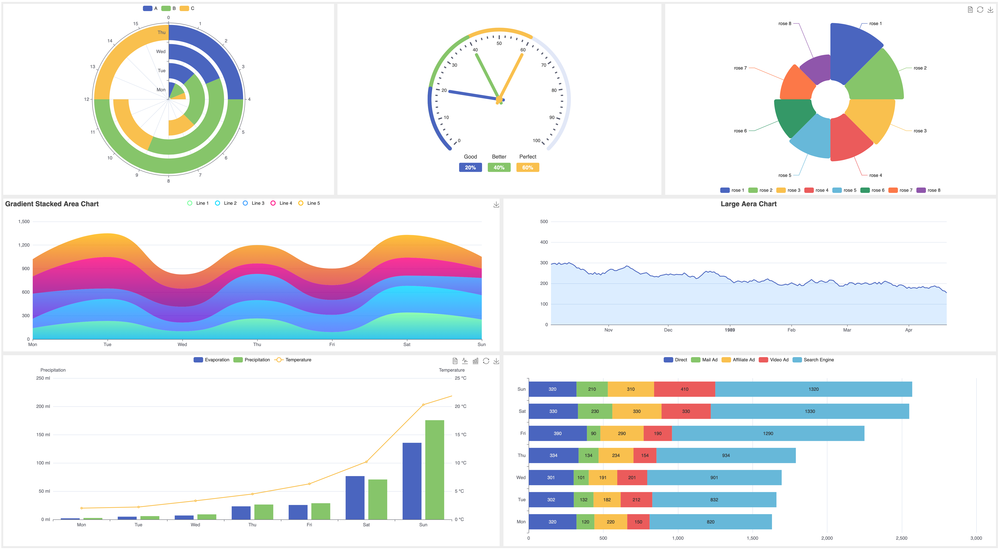
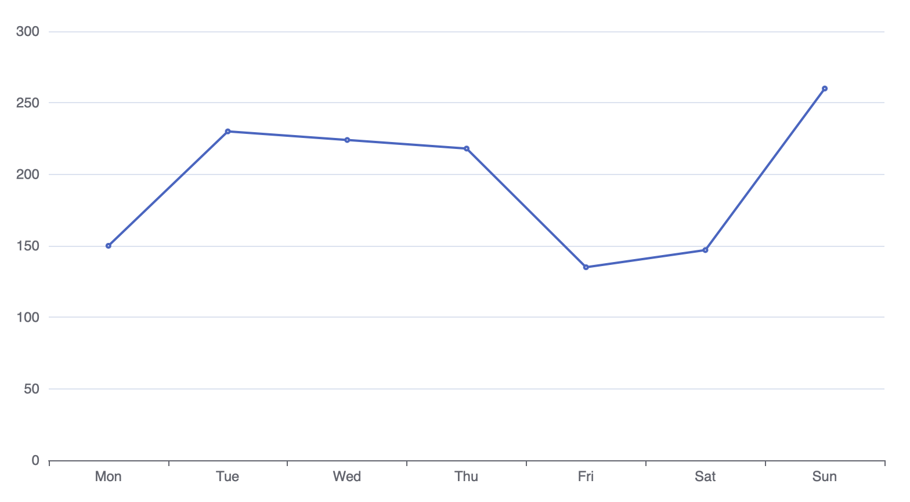
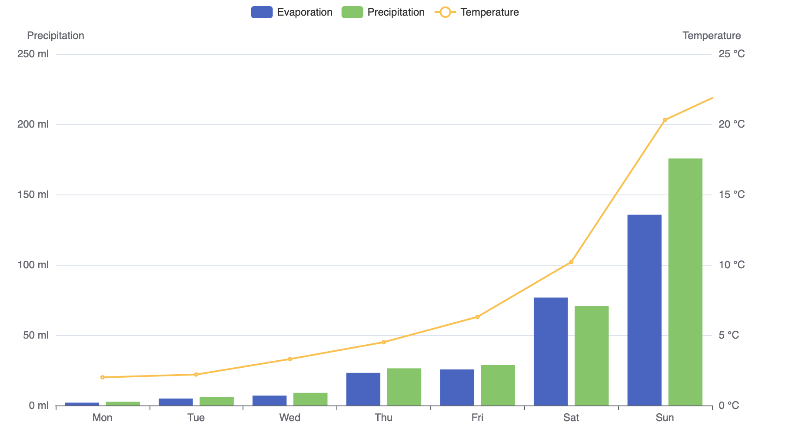
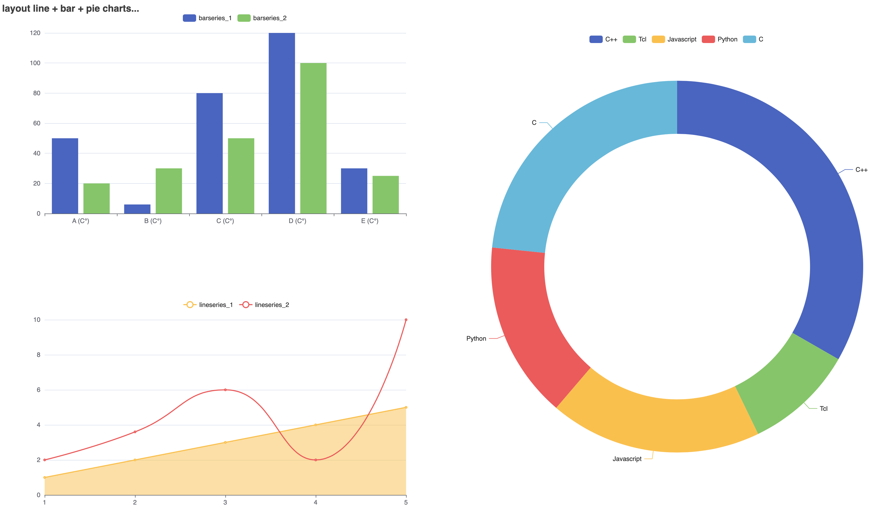

ticklEcharts
==========================
Tcl wrapper around [Apache ECharts](https://echarts.apache.org/en/index.html).



Dependencies :
-------------------------

`huddle` package from [Tcllib](https://core.tcl-lang.org/tcllib/doc/trunk/embedded/index.md)

Usage :
-------------------------

```tcl
package require ticklecharts

set chart [ticklecharts::chart new]

$chart Xaxis -data [list {Mon Tue Wed Thu Fri Sat Sun}]
$chart Yaxis
$chart Add "lineSeries" -data [list {150 230 224 218 135 147 260}]

$chart Render
```

```tcl
# Initializes a new 2D Chart Class
set chart [ticklecharts::chart new]
```
##### Argument available :
| args     | Description | Default value
| ------   | ------      | ------
| _-theme_ | Theme name  | `custom` (possible values: vintage, westeros, wonderland, dark)
```tcl
# Adds the X axis with its values.
$chart Xaxis -data [list {Mon Tue Wed Thu Fri Sat Sun}]

# Adds the Y axis.
$chart Yaxis

# Adds data for line series.
$chart Add "lineSeries" -data [list {150 230 224 218 135 147 260}]
```
> [!IMPORTANT]  
>  `-data` _property_ should be a list of list `[list {...}]`
```tcl
# Export chart to HTML file
$chart Render
```
##### Arguments available :
| args           | Description             | Default values
| ------         | ------                  | ------
| _-title_       | HTML title page         | `"ticklEcharts !!!"`
| _-width_       | Container's width       | `"900px"`
| _-height_      | Container's height      | `"500px"`
| _-renderer_    | canvas or svg           | `"canvas"`
| _-jschartvar_  | Variable name chart     | `chart_[uuid]`
| _-divid_       | Name container's ID     | `id_[uuid]`
| _-outfile_     | Full path HTML file     | `'./render.html'`
| _-jsecharts_   | Script echarts.js       | `https://cdn.jsdelivr.net/...`
| _-jsvar_       | Variable name option    | `option_[uuid]`
| _-script_      | Extra JS script         | `'null'` (see `Add script` section)
| _-class_       | Specify container's CSS | `"chart-container"`
| _-style_       | Inline style            | `"width:'-width'; height:'-height'";`
| _-template_    | File or string template | `'file'` (template.html)

```tcl
# Example properties :
$chart Render -width "1200px" -height "800px" -renderer "svg"
```
Data series :
-------------------------
`-data` (y values only) : 
```tcl
# Example for lineseries
$chart Add "lineSeries" -data [list {150 230 224 218 135 147 260}]
$chart Yaxis
```
`-data` (x, y) : 
```tcl
# Example for lineseries
$chart Add "lineSeries" -data [list {Mon 150} {Tue 230} {Wed 224} {... ...}]
# Mon = X category
# 150 = Y value
# Please note : X data is not included.
$chart Xaxis
$chart Yaxis
```
`-dataItem` :
```tcl
# Example for lineseries
# Additional options are valid, see ticklecharts::lineItem in options.tcl
$chart Add "lineSeries" -dataItem {
    {name "Mon" value 150}
    {name "Tue" value 230}
    {name "Wed" value 224}
    {name "Thu" value 218}
    {name "Fri" value 135}
    {name "Sat" value 147}
    {name "Sun" value 260}
}
```
`-dataset` :
```tcl
set data(0) {
    {"Day" "Mon" "Tue" "Wed" "Thu" "Fri" "Sat" "Sun"}
    {"value" 150 230 224 218 135 147 260}
}

# Init dataset class.
# Note : Starting from version '2.6', it is possible 
# to add several 'items' like this :
# > [list [list source $data(0) sourceHeader "True"] [list source $data(1) ...]]]
set obj [ticklecharts::dataset new [list source $data(0) sourceHeader "True"]]

# Add '$obj' to dataset property. 
$chart SetOptions -dataset $obj
# Add line series.
$chart Xaxis
$chart Yaxis
$chart Add "lineSeries" -seriesLayoutBy "row"
```
Useful methods :
-------------------------

1. Get default _options_ according to a `key` (name of procedure) :
```tcl
# e.g for series :
$chart getOptions -series lineSeries
# e.g for axis :
$chart getOptions -axis X
# e.g for global options :
$chart getOptions -globalOptions ; # no value required
# get all options for 'title' :
$chart getOptions -option title
# output :
 id                -minversion 5  -validvalue {}                      -type str|null    -default "nothing"
 show              -minversion 5  -validvalue {}                      -type bool        -default "True"
 text              -minversion 5  -validvalue {}                      -type str|null    -default "nothing"
 link              -minversion 5  -validvalue {}                      -type str|null    -default "nothing"
 target            -minversion 5  -validvalue formatTarget            -type str         -default "blank"
 textStyle         -minversion 5  -validvalue {}                      -type dict|null
   color                -minversion 5  -validvalue formatColor          -type str.t|jsfunc|null -default $color
   fontStyle            -minversion 5  -validvalue formatFontStyle      -type str               -default "normal"
   fontWeight           -minversion 5  -validvalue formatFontWeight     -type str.t|num.t|null  -default $fontWeight
   fontFamily           -minversion 5  -validvalue {}                   -type str               -default "sans-serif"
   fontSize             -minversion 5  -validvalue {}                   -type num.t|null        -default $fontSize
   lineHeight           -minversion 5  -validvalue {}                   -type num|null          -default "nothing"
   width                -minversion 5  -validvalue {}                   -type num               -default 100
   height               -minversion 5  -validvalue {}                   -type num               -default 50
   textBorderColor      -minversion 5  -validvalue {}                   -type str|null          -default "null"
   textBorderWidth      -minversion 5  -validvalue {}                   -type num               -default 0
   textBorderType       -minversion 5  -validvalue formatTextBorderType -type str|num|list.n    -default "solid"
   textBorderDashOffset -minversion 5  -validvalue {}                   -type num               -default 0
   textShadowColor      -minversion 5  -validvalue formatColor          -type str               -default "transparent"
   textShadowBlur       -minversion 5  -validvalue {}                   -type num               -default 0
   textShadowOffsetX    -minversion 5  -validvalue {}                   -type num               -default 0
   textShadowOffsetY    -minversion 5  -validvalue {}                   -type num               -default 0
   overflow             -minversion 5  -validvalue formatOverflow       -type str|null          -default "null"
   ellipsis             -minversion 5  -validvalue {}                   -type str               -default "..."
   # ...
 subtext           -minversion 5  -validvalue {}                      -type str|null    -default "nothing"
 sublink           -minversion 5  -validvalue {}                      -type str|null    -default "nothing"
 ...
 ...
# Following options voluntarily deleted.
```
2. Delete _series_ by index:
```tcl
$chart Add "lineSeries" -data [list {1 2 3 4}]
$chart Add "barSeries"  -data [list {5 6 7 8}]

# Delete bar series :
$chart deleteSeries 1
```
3. Gets _json_ data :
```tcl
$chart toJSON
```
4. Export _chart_ as HTML fragment :
```tcl
$chart toHTML ?-template ?...
```
5. Add JSON structure:
```tcl
$chart AddJSON $struct ?-parent ?... ; # See '# Structure' section
```
6. Capture an image:
```tcl
$chart SnapShot ?-outfile ?... ; # See '# Image' section
```

Add extra JS script, variable, etc. :
-------------------------
* **Add a JavaScript function** :

When permitted, `ticklecharts::jsfunc` class can insert a function directly in `JSON` data :

```tcl
# Initializes a new jsfunc Class and insert 
# a 'JS function' as argument :
set js [ticklecharts::jsfunc new {
        function (value, index) {
            return value + ' (C°)';
        }
    }
]

# Add $js variable to 'formatter' property. 
$chart Xaxis -axisLabel [subst {
    show "True"
    margin 8
    formatter $js
    showMinLabel "null"
    # ...
}]
$chart toJSON
```
* **Output** :
```js
"axisLabel": {
  "show": true,
  "margin": 8,
  "formatter": function (value, index) {
    return value + ' (C°)';
  },
  "showMinLabel": null,
  // ...
}
```
> [!NOTE]  
> **formatter** accepts a _javascript function_ most times but in some cases `formatter` supports   
[string template](https://echarts.apache.org/en/option.html#grid.tooltip.formatter) like this `'{b0}: {c0}<br />{b1}: {c1}'`

There are three ways to do this :

- Encapsulates the string with braces + quotes :
> {"{b0}: {c0}\<br />{b1}: {c1}"}
- Use ticklecharts::eString _class_ :
> new estr "{b0}: {c0}\<br />{b1}: {c1}"
- Replaces by special chars : (Deprecated)
> "<0123>b0<0125>: <0123>c0<0125>\<br /><0123>b1<0125>: <0123>c1<0125>"

| Chars         | Map      
| ------------- | ---------
| `{`           | <0123>   
| `}`           | <0125>   
| `[`           | <091>    
| `]`           | <093>    

* **Add script, variable etc.** :

Combined with `Render` method and `-script` property, you can add JavaScript elements in the HTML template file.  
* Depending on where you want to insert them, three optional argument are supported :

  - `-start` : To place your element at the beginning of the file. 
  - `-end` : To place your element at the end of the file. 
  - `-header`: To place your element in the file header.

```tcl
# Adds a variable at the start:
set var [ticklecharts::jsfunc new {
        var maskImage = new Image();
        maskImage.src = './logo.png';
    } -start
]

# Adds a header script:
set header [ticklecharts::jsfunc new {
        <script type="text/javascript" src="tcl.js"></script>
    } -header
]
# Note: Inserting a script, variable, etc. in the HTML file is
# based on a search for a string in the template if this is not found,
# an error is generated.
$chart Render -title "Example jsfunc class" -script [list [list $var $header]]
```
* **Output** :
```js
<!DOCTYPE html>
<html>
  <head>
    <meta charset="UTF-8">
    <title>Example jsfunc class</title>
    <script type="text/javascript" src="echarts.min.js"></script>
    <!-- -header <script>...</script> -->
    <script type="text/javascript" src="tcl.js"></script>
  </head>
  <body>
    <div id="main" class="chart-container" style="width:900px; height:500px;"></div>
    <script>
        var chart = echarts.init(document.getElementById('main'), null, {renderer: 'canvas'});
        // -start script...
        var maskImage = new Image();
        maskImage.src = './logo.png';
        var option = {
            "backgroundColor": "rgba(0,0,0,0)",
            "color": [
              // ...
            ],
            "maskImage": maskImage,
            // ...
        }
    </script>
  </body>
</html>
```

Performance :
-------------------------
Since version **2**, some _huddle/ehuddle_ procedures can be replaced by functions written in C with help of [critcl](https://andreas-kupries.github.io/critcl/).  
Critcl package should be available and this command `ticklecharts::eHuddleCritcl` should be set to valid `Tcl_boolean` value.  
You may be processing important data and if you want to gain speed, this command can be useful, below how to use it :
```tcl
package require ticklecharts

# Load critcl package
# Note : A warning message may be displayed on your console
# if there was a problem compiling or loading critcl package
ticklecharts::eHuddleCritcl True

source examples/candlestick/candlestick_large_scale.tcl ; # dataCount set to 200,000
#             | This run (Mac Os Core i7)
#    pure Tcl | 25354915 microseconds per iteration 
#    critcl   |  6338728 microseconds per iteration (≃4x faster)
```
`Note` : _No advantage to use this command with small data._

Type substitution  :
-------------------------
Since version **3.1**, two new classes have been introduced. They allow string and list values to be substituted.  
In some cases, it is difficult to find the type for a variable, since everything is considered to be a string in `Tcl`.  
These 2 classes below get around the problem (partly):
 - ticklecharts::eString
 - ticklecharts::eList

_See [line_eList.tcl](examples/line/line_eList.tcl) and `line and bar mixed` demo to know why this class has been implemented for certain cases_.   

Since version **3.2.3** when default type is `list.d` it can be replaced by `list.s` or `list.n` ehuddle type.  
This improves performance by avoiding the need to scan the list to find the type of data. By example, the default type   
for `Xaxis.data` is `list.d`, this property can be written as follows : 
```tcl
# Note : If you are sure that the X data is of type 'string', you can replace 
# -data [list {...}] property by :
$chart Xaxis -data [new elist.s {...}]
```
Structure :
-------------------------
Since version **3.2.4**, it is now possible to construct your own `JSON`, and a new `eStruct` class has been added   
for this purpose. The idea here is to give the user the choice of making their own structure.   

```tcl
# The keys must be typed (str, struct, bool...).
# Be careful, input data is not verified, you have control.
new estruct myStruct {
    key1:num    "number value"
    key2:str    "string value"
    key3:list.n "list of numbers"
    key4:bool   "boolean value"
    key5:...    "..."
}
# Optional argument to 'AddJSON' method: 
# '-parent' (with or without index).
# With this optional argument, we can add our structure to a specific location.
$chart AddJSON $myStruct ?-parent ?key1(?index).?key2(?index)
```
_See [line_build_your_own_JSON.tcl](examples/line/line_build_your_own_JSON.tcl) for a more detailed example_.  

Image :
-------------------------
Since version **3.2.4**, if `Chromium` (web browser) is installed, it is possible to capture an image 
via `chrome devtools protocol`. The return type for image is either a `*.(png|svg)` file or data in `base64` format.   

_Dependencies_ : `websocket` package from [Tcllib](https://core.tcl-lang.org/tcllib/doc/trunk/embedded/index.md)   

##### Arguments available :
| args                 | Description                  | Default values
| ------               | ------                       | ------
| _-address_           | Local adress                 | `"127.0.0.1"`
| _-port_              | Port number                  | `8888`
| _-exe_               | Full path executable         | `"/Applications/Google Chrome.app/Contents/MacOS/Google Chrome"`
| _-html_              | Html fragment                | `"nothing"`
| _-renderer_          | base64, png or svg           | `"png"`
| _-outfile_           | Full path file               | `"./render.(png\|svg)"`
| _-excludecomponents_ | Excluded components          | `"nothing"` (List e.g. `['toolbox', 'title', '...']`)
| _-timeout_           | Time to execute JS function  | `400` (milliseconds)

```tcl
# Note : Animations must be disabled, which is not the case by default. 
$chart SetOptions -animation "False"
# ...
$chart SnapShot -timeout 600 -port 8080 ;  # Returns full path '*.png' file

# Example with 'html' fragment on Windows :
#
# Export '$chart' as HTML fragment.
set html [$chart toHTML]
# Note : A full path should be specified if 'msedge.exe' is not included in 'env(PATH)'.
$chart SnapShot -exe "msedge.exe" -html $html -renderer "base64"

# For 'svg' renderer it's important to set the '-renderer' property
# to 'svg' in 'toHTML' method.
set html [$chart toHTML -renderer "svg"]
$chart SnapShot -renderer "svg" -html $html
# ...
```
> [!NOTE]   
> - A temporary file is created when the command is executed (This may change in future versions of `ticklEcharts`).   
> - Method not supported with 'chart3D' class.
> - Highly unstable, depends on the version of `Chromium` installed.   

Global variables :
-------------------------
```tcl
package require ticklecharts

# Set theme with global variable
# Or with class : ticklecharts::(Gridlayout|chart|timeline|chart3D) new -theme "vintage"
set ::ticklecharts::theme "vintage" ; # default "custom" 

# Minimum properties:
# Only write values that are defined in the *.tcl file. (Benefit : performance + minifying your HTML files)
# Be careful, properties in the *.tcl file must be implicitly marked.
set ::ticklecharts::minProperties "True" ; # default "False"

# Output 'render.html' full path to stdout. 
set ::ticklecharts::htmlstdout "False" ; # default "True"

# Google API Key 
# Note : To use the Google map API 'gmap' a valid key is required.
set ::ticklecharts::keyGMAPI "??" ; # Please replace '??' with your own API key.

# Set versions for js script.
# Note : Num version (@X.X.X) should be defined in js path. If no pattern matches, the script path is left unchanged.
set ::ticklecharts::echarts_version "X.X.X" ; # Echarts version
set ::ticklecharts::gl_version      "X.X.X" ; # Echarts GL version
set ::ticklecharts::gmap_version    "X.X.X" ; # gmap version
set ::ticklecharts::wc_version      "X.X.X" ; # wordcloud version

 # Verify if a URL exists when Echarts version changed.
set ::ticklecharts::checkURL "True" ; # default "False"
```
_All the above variables can be modified in the `ticklecharts.tcl` file_.

Examples :
-------------------------
See the **[examples](/examples)** folder for all demos (from [Apache Echarts examples](https://echarts.apache.org/examples/en/index.html))


```tcl
# line + bar on same canvas.
package require ticklecharts

# Initializes a new 2D Chart Class.
set chart [ticklecharts::chart new]

# Set options
$chart SetOptions -tooltip {show True trigger "axis" axisPointer {type "cross" crossStyle {color "#999"}}} \
                  -grid {left "3%" right "4%" bottom "3%" containLabel "True"} \
                  -legend {}
               
$chart Xaxis -data [list {"Mon" "Tue" "Wed" "Thu" "Fri" "Sat" "Sun"}] \
             -axisPointer {type "shadow"}

# Encapsulates the string with braces + quotes or use 'ticklecharts::eString'
# class for 'formatter' property (See '# string template' section).
$chart Yaxis -name "Precipitation" -position "left" -min 0 -max 250 -interval 50 \
                                   -axisLabel {formatter {"{value} ml"}}
$chart Yaxis -name "Temperature"   -position "right" -min 0 -max 25  -interval 5 \
                                   -axisLabel [list formatter [new estr "{value} °C"]]

# Add bars series.
$chart Add "barSeries" -name "Evaporation" \
                       -data [list {2.0 4.9 7.0 23.2 25.6 76.7 135.6 162.2 32.6 20.0 6.4 3.3}]
                    
$chart Add "barSeries" -name "Precipitation" \
                       -data [list {2.6 5.9 9.0 26.4 28.7 70.7 175.6 182.2 48.7 18.8 6.0 2.3}]                    

# Add line series.                  
$chart Add "lineSeries" -name "Temperature" \
                        -yAxisIndex 1 \
                        -data [list {2.0 2.2 3.3 4.5 6.3 10.2 20.3 23.4 23.0 16.5 12.0 6.2}]

# Output
$chart Render
```

```tcl
# Demo layout with line, bar and pie charts.
set data(0) {1 2 3 4 5}
set data(1) {2 3.6 6 2 10}

# Format label
set js [ticklecharts::jsfunc new {
    function (value, index) {
        return value + ' (C°)';
    },
}]

set line [ticklecharts::chart new]
                  
$line SetOptions -title   {text "layout line + bar + pie charts..."} \
                 -tooltip {show "True"} \
                 -legend {top "56%" left "20%"}    
    
$line Xaxis -data [list $data(0)] -boundaryGap "False"
$line Yaxis
$line Add "lineSeries" -data [list $data(0)] -areaStyle {} -smooth "True"
$line Add "lineSeries" -data [list $data(1)] -smooth "True"

set bar [ticklecharts::chart new]

$bar SetOptions -legend {top "2%" left "20%"}

$bar Xaxis -data [list {A B C D E}] \
           -axisLabel [list show "True" formatter $js]
$bar Yaxis
$bar Add "barSeries" -data [list {50 6 80 120 30}]
$bar Add "barSeries" -data [list {20 30 50 100 25}]

set pie [ticklecharts::chart new]

$pie SetOptions -legend {top "6%" left "65%"} 

$pie Add "pieSeries" -name "Access From" -radius [list {"50%" "70%"}] \
                     -labelLine {show "True"} \
                     -dataItem {
                        {value 1048 name "C++"}
                        {value 300 name "Tcl"}
                        {value 580 name "Javascript"}
                        {value 484 name "Python"}
                        {value 735 name "C"}
                    }

# Initializes a new 'Gridlayout' Class.
set layout [ticklecharts::Gridlayout new]

# Arrange the different series on the canvas.
$layout Add $bar  -bottom "60%" -width "40%" -left "5%"
$layout Add $line -top    "60%" -width "40%" -left "5%"
$layout Add $pie  -center [list {75% 50%}]

$layout Render
```
#### Currently chart and options supported are :
- **Global options :**
- [x] title
- [x] legend
- [x] grid
- [x] grid3D
- [x] xaxis
- [x] xaxis3D
- [x] yaxis
- [x] yaxis3D
- [x] zaxis3D
- [x] polar
- [x] radiusAxis
- [x] angleAxis
- [x] radar
- [x] dataZoom
- [x] visualMap
- [x] tooltip
- [x] axisPointer
- [x] toolbox
- [x] brush
- [x] geo
- [x] parallel
- [x] parallelAxis
- [x] singleAxis
- [x] timeline
- [x] graphic
- [x] calendar
- [x] dataset
- [x] aria
- [x] globe
- **Series :**
- [x] line
- [x] line3D
- [x] lines3D
- [x] bar
- [x] bar3D
- [x] pie
- [x] scatter
- [x] scatter3D
- [x] effectScatter
- [x] radar
- [x] tree
- [x] treemap
- [x] sunburst
- [x] boxplot
- [x] candlestick
- [x] heatmap
- [x] map
- [x] parallel
- [X] lines
- [x] graph
- [x] sankey
- [x] surface (3D)
- [x] funnel
- [x] gauge
- [x] pictorialBar
- [x] themeRiver
- [ ] custom (see _note_ below)
- [x] wordCloud

> [!NOTE]  
> _custom_ series contains a lot of _Javascript_ codes, I don’t think it’s interesting to write it in this package.  
> If you are interested, please report to the github issue tracker.

License :
-------------------------
**ticklEcharts** is covered under the terms of the [MIT](LICENSE) license.

Change log :
-------------------------
See detailed [changes](CHANGELOG.md) for each release.